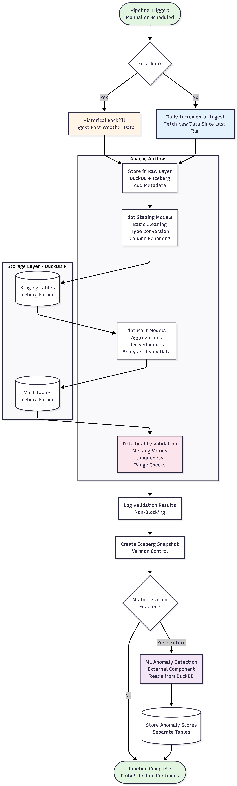

# Technical Design

## Overview

This document describes the technical design of the ETL pipeline used in this project.
The pipeline is designed to run locally and process weather data in batch mode.
Its main goal is to ingest data reliably, apply structured transformations, and perform data quality checks.
The design also allows ML-based anomaly detection to be added later without changing the core pipeline.

---

## System Architecture

The system follows a layered ETL design.
Data is first ingested from an external API, then stored in raw form.
After ingestion, transformations and validations are applied before the data is used for analysis.
Each part of the system has a single responsibility to keep the pipeline easy to understand and extend.

Apache Airflow is used to control execution order and scheduling.
DuckDB is used for storage and querying with Parquet files.
dbt is used to manage transformations and data quality checks.

---

## Data Ingestion

The ingestion layer is responsible for extracting data from the Open-Meteo weather APIs.
Both historical weather data and daily updates are ingested.

The first execution performs a historical backfill and loads past data into the system.
After this, the pipeline runs daily and only fetches new data since the last successful ingestion.
This approach reflects how real ETL pipelines operate over time.

Ingestion is implemented using Python scripts.
The scripts perform minimal processing and add basic metadata such as ingestion time and batch identifiers.
No validation or cleaning is done at this stage.

---

## Orchestration

Apache Airflow is used to orchestrate the pipeline.
Airflow manages task execution order, scheduling, and retries.
Each pipeline run consists of ingestion, loading, transformation, and validation steps.

Historical ingestion is triggered manually, while daily ingestion is scheduled.
If a task fails, Airflow retries execution without affecting previously ingested data.

---

## Storage Design

DuckDB is used as the analytical database.
It allows SQL queries to be executed directly on local data without running a separate server.
This makes the system easy to set up and maintain.

Data is stored in Parquet format, which DuckDB can query efficiently.
Versioning is handled through timestamped snapshots and DuckDB's native capabilities.
This makes it possible to reproduce experiments and compare different versions of the data.

Data is stored in three logical layers.
Raw tables store ingested data without modification.
Staging tables apply basic cleaning and type conversion.
Mart tables contain aggregated and analysis-ready data.

---

## Data Transformation

Data transformations are handled using dbt.
dbt models are written in SQL and define how data moves from raw to staging and mart layers.

Transformations include renaming columns, casting data types, and computing simple derived values.
All transformation logic is version controlled and easy to review.

Schema information and metadata are stored in dbt configuration files.
These files also contain basic validation rules and optional metadata that can be used later for ML-based profiling.

---

## Data Quality Validation

Rule-based data quality checks are applied after transformations.
These checks include missing value checks, uniqueness constraints, and value range checks.

Validation results are recorded for analysis but do not stop the pipeline.
This allows the system to collect information about data quality issues without blocking data availability.
The rule-based checks serve as a baseline for later comparison with ML-based anomaly detection.

---

## Incremental Processing

The pipeline is designed to support incremental processing.
Each ingestion run tracks the most recent timestamp that was successfully processed.
Only new data is fetched during daily runs.

DuckDB table snapshots and timestamped data make it possible to compare data across different pipeline executions.
This is useful for studying how data quality changes over time.

---

## Preparation for ML Integration

The ETL pipeline is independent of any ML components.
ML-based anomaly detection can later be added as a separate step that reads processed data from DuckDB.

Anomaly scores and flags can be stored alongside existing tables without modifying the original data.
This design ensures that the pipeline remains stable even if ML experiments change.
